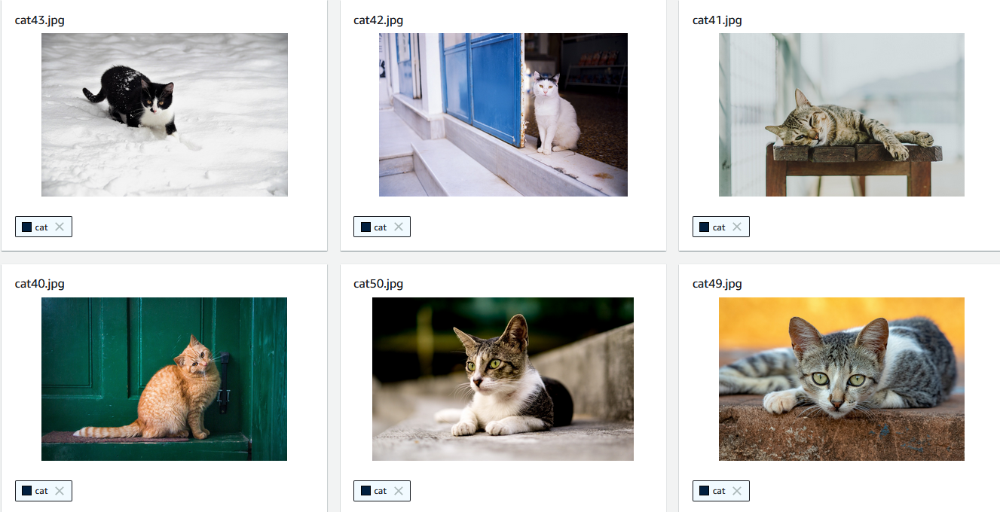

# Rekognition-ECR Demo

In this part of the DEMO, you will be doing the following:-

- Creating a Rekognition model that will be used to detect cats and dogs in images.
- Training the model with a set of images that contain cats and dogs.

# STAGE 1 - Create and train the Rekognition model

Navigate to the Rekognition console: https://us-east-1.console.aws.amazon.com/rekognition/home?region=us-east-1#/

In the left-hand menu, click on "Use Custom Labels".

Click on the "Get started" button.

A pop-up window will appear if you **have not created** a Rekognition Custom Labels project before. This pop-up windows will ask you to create an S3 bucket to store all the data related to the model that you will be training. Save the name of the bucket that will be created, it will have the following format: `custom-labels-console-us-east-1-<random string>`. You will need it in the cleanup stage. Click on the "Create S3 bucket" button to create the S3 bucket.

In the left-hand menu, click on "Projects" and create a project with the name "skynet-cats-and-dogs".
Click on the "Create dataset" button and select the following options:
 - Configuration options: Start with a single dataset
 - Training dataset details: Upload images from your computer
 - Click Create Dataset

In the following screen, you will be able to upload the images that will be used to train the model. These images are contained in the following files:-

- [Cats-part1](https://learn-cantrill-labs.s3.amazonaws.com/aws-pet-rekognition-ecr/Cat-Dataset-part1.zip)
- [Cats-part2](https://learn-cantrill-labs.s3.amazonaws.com/aws-pet-rekognition-ecr/Cat-Dataset-part2.zip)
- [Cats-part3](https://learn-cantrill-labs.s3.amazonaws.com/aws-pet-rekognition-ecr/Cat-Dataset-part3.zip)
- [Cats-part4](https://learn-cantrill-labs.s3.amazonaws.com/aws-pet-rekognition-ecr/Cat-Dataset-part4.zip)
- [Cats-part5](https://learn-cantrill-labs.s3.amazonaws.com/aws-pet-rekognition-ecr/Cat-Dataset-part5.zip)
- [Cats-part6](https://learn-cantrill-labs.s3.amazonaws.com/aws-pet-rekognition-ecr/Cat-Dataset-part6.zip)
- [Dogs-part1](https://learn-cantrill-labs.s3.amazonaws.com/aws-pet-rekognition-ecr/Dog-Dataset-part1.zip)
- [Dogs-part2](https://learn-cantrill-labs.s3.amazonaws.com/aws-pet-rekognition-ecr/Dog-Dataset-part2.zip)
- [Dogs-part3](https://learn-cantrill-labs.s3.amazonaws.com/aws-pet-rekognition-ecr/Dog-Dataset-part3.zip)
- [Dogs-part4](https://learn-cantrill-labs.s3.amazonaws.com/aws-pet-rekognition-ecr/Dog-Dataset-part4.zip)
- [Dogs-part5](https://learn-cantrill-labs.s3.amazonaws.com/aws-pet-rekognition-ecr/Dog-Dataset-part5.zip)
- [Dogs-part6](https://learn-cantrill-labs.s3.amazonaws.com/aws-pet-rekognition-ecr/Dog-Dataset-part6.zip)

Unzip the files. You should see a total of 12 foldeds.  
Currently, the AWS console allows you to upload 30 images at a time, so you will need to do it in multiple attempts. 

- Click on the top-right "Actions" button and then click on "Add images to training dataset" to start uploading the images. 
- Click Choose files
- Go inside the folder for the first part of the cat images
- Select all the images
- Click open
- Then Click `Upload Images`

Wait until you see `You successfully saved the changes to your training dataset.`. Then repeat the process for the remaining 5 folders of Cat images (*we will be doing the dog images in a separate step*)

Once you have uploaded all `6` of the cat image folders, click `Start Labeling` then click `Add Labels`, and select `Add Labels`.  
Add a label `cat` click `Add label` 
and add another `dog`, click `Add label` then click `Save`  

Select `Unlabeled` on the `Labels` list on the left, and go through each page of images :

- select all the images
- Click `Assign Image-Level Labels`
- Type `cat` and select the `cat` label and click `Assign`

Move to the next page and Continue the above process for all pages of cat images.  
Once you've finished you can click `Save Changes`  
Once saved, you should have `0` unlabeled images.  

Now it's time to repeat the process for the dog images within the dataset.  

- Click on the top-right "Actions" button and then click on "Add images to training dataset" to start uploading the images. 
- Click Choose files
- Go inside the folder for the first part of the dog images
- Select all the images
- Click open
- Then Click `Upload Images`

Wait until you see `You successfully saved the changes to your training dataset.`. Then repeat the process for the remaining 5 folders of Dog images 

Once finished, select `Unlabeled` from the labels menu on the bottom left. You should see all the dog images.  
Click `Start Labelling`  and go through each page of images

- select all the images
- Click `Assign Image-Level Labels`
- Type `dog` and select the `dog` label and click `Assign`

Once you have done all pages, scroll to the top and click `Save Changes`.  
Make sure you see `0` unlabelled images.  

Click on the top-right "Train model" button. In the next screen, click on the "Train model" button and then click again on the "Train model" button that appears in the pop-up window.

To check the progress of the training, take a look at the "Model status" column. It will change the status to TRAINING_COMPLETED once the training is complete. The training process can take approximately 40-60 minutes to complete, so you can start the stages 2 and 3A while the model is being trained.

